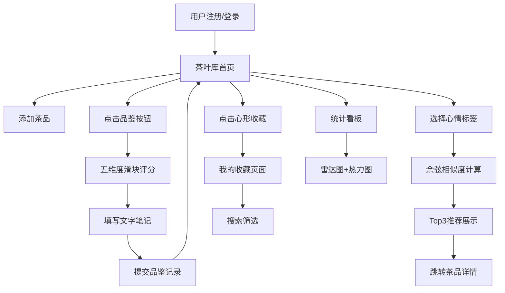

## 1. 产品概述

茶馆茶叶品鉴记录与个性化推荐应用，专为茶叶爱好者打造，解决面对众多茶品无法系统记录品鉴笔记、难以快速选出符合当日心情茶品的痛点。

- 核心价值：构建个人茶叶知识库，通过数据化品鉴记录实现科学选茶
- 目标用户：茶叶收藏爱好者、茶馆经营者、茶艺学习者

## 2. 核心功能

### 2.1 用户角色

| 角色 | 注册方式 | 核心权限 |
|------|----------|----------|
| 普通用户 | 账户注册 | 茶叶库管理、品鉴记录、个性化推荐、收藏夹、统计看板 |

### 2.2 功能模块

1. **首页/茶叶库**：茶叶卡片网格展示，品鉴与收藏快捷入口
2. **品鉴记录页**：五维度滑块评分、文字笔记、提交保存
3. **推荐面板**：心情标签选择、余弦相似度匹配、Top3推荐展示
4. **统计看板**：总览数据、雷达图、月度热力图
5. **我的收藏**：瀑布流布局、搜索筛选、收藏管理

### 2.3 页面详情

| 页面名称 | 模块名称 | 功能描述 |
|----------|----------|----------|
| 茶叶库首页 | 导航栏 | 固定顶部，页面切换，响应式汉堡菜单 |
| 茶叶库首页 | 卡片网格 | 200x280px卡片，渐变背景，圆形茶样图，品鉴/收藏按钮 |
| 品鉴记录页 | 五维评分 | 香气/滋味/汤色/叶底/回甘滑块打分（1-10分） |
| 品鉴记录页 | 笔记输入 | 多行文本框，焦点高亮边框 |
| 品鉴记录页 | 记录展示 | 卡片底部显示总分与最近三条笔记摘要 |
| 推荐面板 | 心情标签 | 药丸形标签（清甜/醇厚/花香/烟熏/鲜爽），点击高亮 |
| 推荐面板 | 推荐结果 | 横向滚动卡片，160x200px，匹配度+推荐理由 |
| 统计看板 | 数据总览 | 总品鉴次数、平均分展示 |
| 统计看板 | 雷达图 | Canvas五边形网格，五维评分可视化 |
| 统计看板 | 热力图 | Canvas 7x5网格，月度品鉴次数渐变着色 |
| 我的收藏 | 瀑布流 | 自适应列宽瀑布流布局 |
| 我的收藏 | 搜索框 | 按茶名/年份模糊搜索 |

## 3. 核心流程

用户注册登录后进入茶叶库首页，浏览个人茶品卡片。点击品鉴按钮进入评分页面，完成五维度打分和笔记记录后提交。返回首页时卡片更新显示最新品鉴信息。选择今日心情标签，系统基于余弦相似度算法计算匹配度并展示前三推荐茶品。进入统计看板查看雷达图和月度热力图，点击心形图标收藏喜欢的茶品，在收藏页瀑布流浏览和搜索。

## 4. 用户界面设计

### 4.1 设计风格

- **主色调**：#7b1fa2（深紫）
- **辅助色**：#ce93d8（淡紫）、#e1bee7（极淡紫）、#e91e63（收藏玫红）
- **背景色**：#fafafa（浅灰白）
- **卡片背景**：#ffffff 至 #f3e5f5 渐变
- **文字色**：#333333（正文）、#757575（辅助）、#4a148c（强调）
- **按钮**：圆角设计，hover时1.1倍缩放+0.1s阴影
- **输入框**：聚焦时边框高亮+背景淡入
- **图标**：lucide-react图标库，咖啡杯/心形等语义图标

### 4.2 页面设计概述

| 页面名称 | 模块名称 | UI元素 |
|----------|----------|--------|
| 茶叶库首页 | 茶卡片 | 200x280px圆角12px，顶部渐变背景，80px圆形茶样图（3px紫色边框），18px粗体茶名，右下36px圆形品鉴按钮（咖啡杯图标） |
| 品鉴记录页 | 评分滑块 | 220x6px轨道，18px圆形滑块，刻度圆点#e0e0e0→#7b1fa2渐变 |
| 品鉴记录页 | 笔记框 | 100%宽120px高，1px淡紫边框圆角8px，聚焦时深紫边框 |
| 推荐面板 | 心情标签 | 药丸形圆角20px，背景#e1bee7，选中时#7b1fa2白字 |
| 推荐面板 | 推荐卡 | 160x200px圆角10px，#f5f5f5背景，横向滚动 |
| 统计看板 | 雷达图 | Canvas五边形网格，#ce93d8线条，50%透明度填充 |
| 统计看板 | 热力图 | Canvas 7列5行，#f3e5f5→#4a148c渐变着色 |
| 我的收藏 | 收藏心 | 空心2px玫红边框，点击填充+0.2s缩放动画 |
| 我的收藏 | 瀑布流 | 最小列宽200px，自适应列数 |
| 全局 | 导航栏 | 固定顶部56px高，#7b1fa2背景白字，圆角按钮 |
| 全局 | 页面切换 | 左右滑动0.3s ease过渡 |
| 全局 | 图表动画 | fadeIn 0.5s ease-out |

### 4.3 响应式

- **桌面端（>1024px）**：多列卡片网格，完整导航栏
- **平板端（768px-1024px）**：减少列数，中等间距
- **手机端（<768px）**：单列/双列，汉堡菜单，触控优化

### 4.4 性能要求

- 雷达图/热力图Canvas绘制时间：≤50ms
- 页面切换首屏内容：≤300ms
- 动画流畅度：CSS动画优先，避免重排
