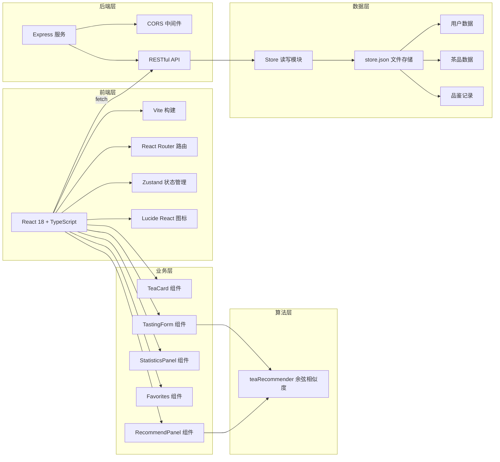
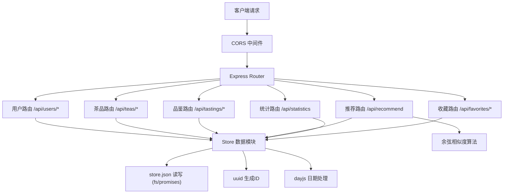
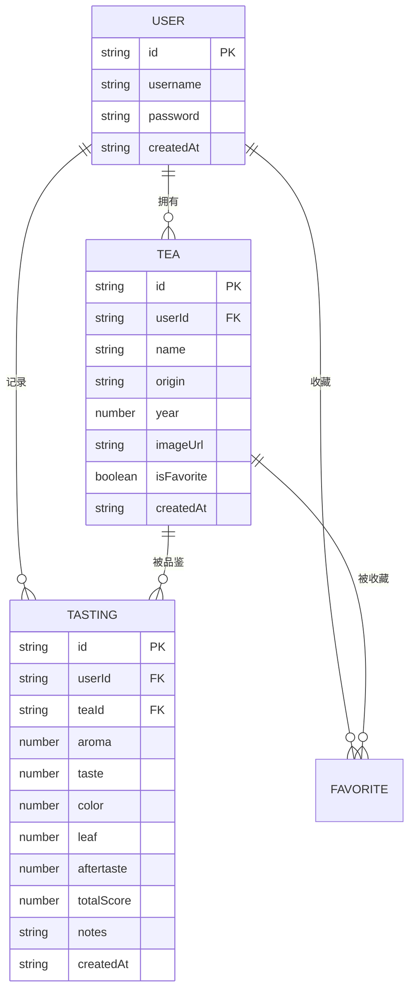

## 1. 架构设计



## 2. 技术说明

- **前端框架**：React 18 + TypeScript 5 + Vite 6
- **路由管理**：react-router-dom v6
- **状态管理**：Zustand（轻量全局状态）
- **HTTP通信**：原生 fetch API
- **后端框架**：Express 4
- **跨域处理**：cors 中间件
- **唯一标识**：uuid
- **日期处理**：dayjs
- **数据存储**：本地 JSON 文件（store.json）
- **图表绘制**：原生 Canvas API（雷达图、热力图）
- **图标库**：lucide-react

## 3. 路由定义

### 前端路由

| 路由路径 | 页面组件 | 用途 |
|----------|----------|------|
| / | TeaLibraryPage | 茶叶库首页，展示所有茶品卡片 |
| /tasting/:teaId | TastingPage | 品鉴记录页，五维度评分+笔记 |
| /recommend | RecommendPage | 推荐面板，心情标签+推荐结果 |
| /statistics | StatisticsPage | 统计看板，雷达图+热力图 |
| /favorites | FavoritesPage | 我的收藏，瀑布流+搜索 |
| /register | RegisterPage | 用户注册页 |
| /login | LoginPage | 用户登录页 |

### 后端 API 路由

| 方法 | 路径 | 用途 |
|------|------|------|
| POST | /api/users/register | 用户注册 |
| POST | /api/users/login | 用户登录 |
| GET | /api/teas | 获取当前用户茶叶库 |
| POST | /api/teas | 新增茶品 |
| PUT | /api/teas/:id | 更新茶品信息 |
| DELETE | /api/teas/:id | 删除茶品 |
| GET | /api/tastings | 获取品鉴记录列表 |
| POST | /api/tastings | 新增品鉴记录 |
| GET | /api/tastings/:teaId | 获取某茶品品鉴历史 |
| POST | /api/recommend | 基于心情标签计算推荐 |
| GET | /api/statistics | 获取统计数据 |
| POST | /api/favorites/:teaId | 收藏/取消收藏茶品 |
| GET | /api/favorites | 获取收藏列表 |

## 4. API 定义（TypeScript 类型）

```typescript
// 用户
interface User {
  id: string;
  username: string;
  password: string;
  createdAt: string;
}

// 茶品
interface Tea {
  id: string;
  userId: string;
  name: string;
  origin: string;
  year: number;
  imageUrl: string;
  isFavorite: boolean;
  createdAt: string;
}

// 品鉴记录
interface TastingRecord {
  id: string;
  userId: string;
  teaId: string;
  scores: {
    aroma: number;      // 香气 1-10
    taste: number;      // 滋味 1-10
    color: number;      // 汤色 1-10
    leaf: number;       // 叶底 1-10
    aftertaste: number; // 回甘 1-10
  };
  notes: string;
  totalScore: number;
  createdAt: string;
}

// 心情标签类型
type MoodTag = '清甜' | '醇厚' | '花香' | '烟熏' | '鲜爽';

// 推荐结果
interface RecommendResult {
  tea: Tea;
  matchScore: number;
  reason: string;
  latestTasting?: TastingRecord;
}

// 统计数据
interface Statistics {
  totalTastings: number;
  averageScore: number;
  dimensionAverages: {
    aroma: number;
    taste: number;
    color: number;
    leaf: number;
    aftertaste: number;
  };
  monthlyHeatmap: number[][]; // 7列x5行
}
```

## 5. 服务端架构图



## 6. 数据模型

### 6.1 数据模型定义



### 6.2 store.json 结构

```json
{
  "users": [
    {
      "id": "uuid",
      "username": "string",
      "password": "string",
      "createdAt": "ISO8601"
    }
  ],
  "teas": [
    {
      "id": "uuid",
      "userId": "uuid",
      "name": "string",
      "origin": "string",
      "year": 2024,
      "imageUrl": "string",
      "isFavorite": false,
      "createdAt": "ISO8601"
    }
  ],
  "tastings": [
    {
      "id": "uuid",
      "userId": "uuid",
      "teaId": "uuid",
      "scores": {
        "aroma": 8,
        "taste": 9,
        "color": 7,
        "leaf": 8,
        "aftertaste": 9
      },
      "notes": "string",
      "totalScore": 8.2,
      "createdAt": "ISO8601"
    }
  ]
}
```
