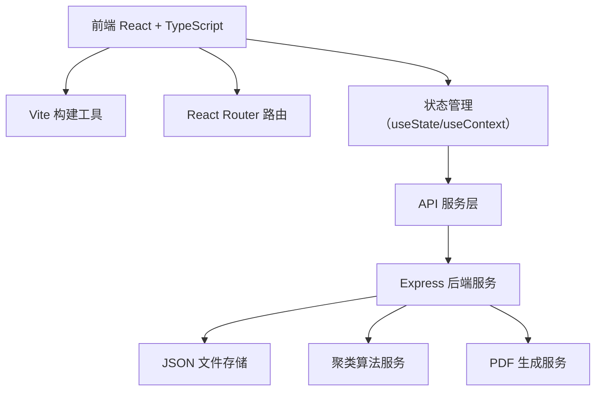
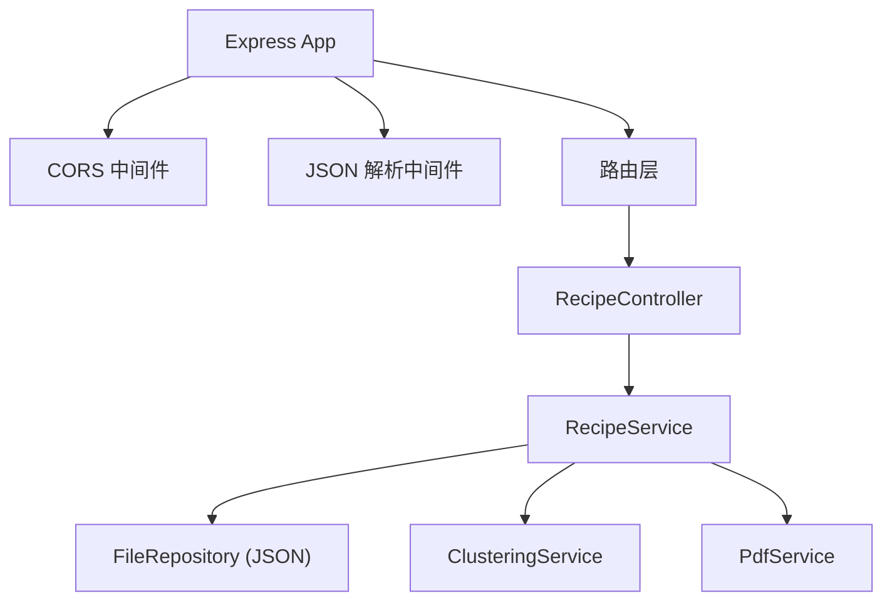

## 1. 架构设计



## 2. 技术描述

- **前端**：React@18 + TypeScript + Vite
- **构建工具**：Vite@5（端口3000）
- **路由**：react-router-dom@6
- **后端**：Express@4
- **数据存储**：JSON 文件（recipes.json）
- **PDF生成**：jspdf + html2canvas
- **日期处理**：dayjs
- **唯一ID**：uuid
- **跨域**：cors

## 3. 路由定义

| 路由 | 用途 |
|------|------|
| / | 时间线页面，展示所有菜谱列表 |
| /recipe/:id | 菜谱详情页，步骤编辑和管理 |
| /recipe/new | 创建新菜谱 |

## 4. API 定义

### 4.1 数据类型定义

```typescript
interface RecipeStep {
  id: string;
  photo: string; // base64
  description: string;
  duration: number; // minutes
  rating: number; // 1-5
  order: number;
}

interface Recipe {
  id: string;
  name: string;
  createdAt: string; // ISO date
  steps: RecipeStep[];
  totalDuration: number;
  averageRating: number;
}
```

### 4.2 API 接口

| 方法 | 路径 | 描述 | 请求体 | 响应 |
|------|------|------|--------|------|
| GET | /api/recipes | 获取所有菜谱 | - | Recipe[] |
| GET | /api/recipes/:id | 获取单个菜谱 | - | Recipe |
| POST | /api/recipes | 创建新菜谱 | Partial<Recipe> | Recipe |
| PUT | /api/recipes/:id | 更新菜谱 | Recipe | Recipe |
| DELETE | /api/recipes/:id | 删除菜谱 | - | { success: boolean } |
| POST | /api/recipes/:id/rating | 提交评分 | { stepId: string, rating: number } | Recipe |
| POST | /api/recipes/:id/recommend | 获取推荐菜谱 | - | { recipe: Recipe, similarity: number }[] |
| POST | /api/recipes/:id/pdf | 生成PDF | { html: string } | { pdf: string } (base64) |

## 5. 服务端架构图



## 6. 项目结构

```
auto4/
├── package.json
├── vite.config.js
├── tsconfig.json
├── index.html
├── src/
│   ├── App.tsx              # 主应用，路由和全局状态
│   ├── pages/
│   │   └── RecipeTimeLine.tsx  # 时间线页面
│   ├── components/
│   │   └── StepCard.tsx     # 步骤卡片组件
│   └── utils/
│       └── recipeClustering.ts  # 聚类算法
└── server/
    └── server.ts            # Express 服务端
```

## 7. 性能优化

- **图片压缩**：上传后压缩到宽度480px，使用Canvas API
- **懒加载**：时间线图片懒加载
- **防抖**：API请求防抖处理
- **缓存**：菜谱列表本地缓存
- **虚拟滚动**：100条以上菜谱时启用虚拟滚动
- **节流**：拖拽排序使用requestAnimationFrame节流
